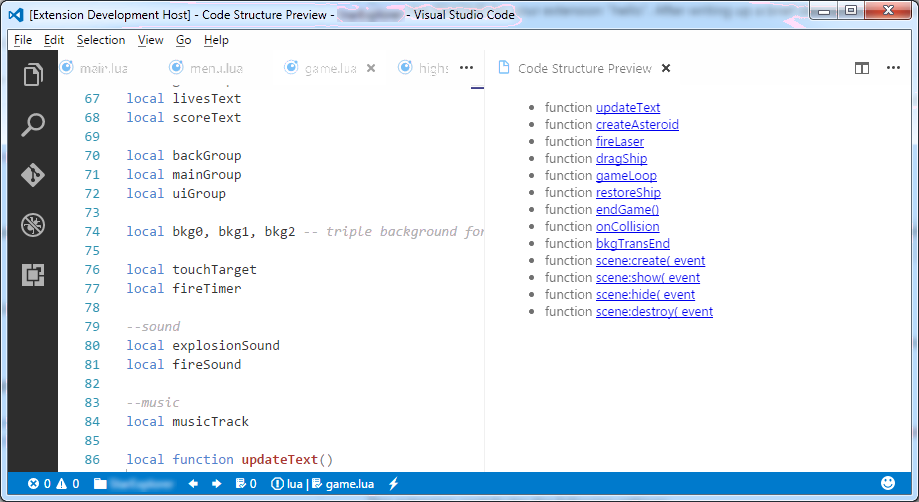

# Code Structure Preview readme

**Code Structure Preview** is a plugin for [Microsoft Visual Studio Code](https://code.visualstudio.com/) that shows the code structure from
the current editor in a preview tab on the second column. Symbols are listed as hyperlinks.

Current version only shows functions.

## Features

You can open the code structure preview by using either of these methods:

* Press **Alt + Shift + C**, or
* Press **F1** or **Ctrl + Shift + P**, then select **Code Structure Preview**

With the preview open, click a link to move the cursor to the selected symbol.

<!--- ## Requirements

If you have any requirements or dependencies, add a section describing those and how to install and configure them.

## Extension Settings

Include if your extension adds any VS Code settings through the `contributes.configuration` extension point.

For example:

This extension contributes the following settings:

* `myExtension.enable`: enable/disable this extension
* `myExtension.thing`: set to `blah` to do something -->

## Known Issues

Calling out known issues can help limit users opening duplicate issues against your extension.

## Release Notes

### 0.0.1

First working version with limited functionality
